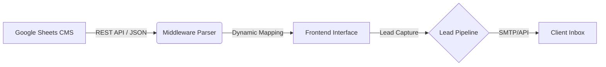

```markdown
# Beauty Catalyst Engine 💄
**High-Performance Beauty Catalog & Headless CMS Lead Generation System.**

[](#)
[](#)
[](#)
[](#)

A production-grade web engine tailored for the luxury beauty and cosmetic sector. This system implements a **Zero-Build CMS** architecture, allowing non-technical stakeholders to manage high-velocity inventory updates via Google Sheets while maintaining a blazing-fast, SEO-optimized frontend experience.

---

## 🚀 Live Production Environment
**[Explore the Interface ↗](https://demomakeup.netlify.app/)**

---

## 📸 Interface Showcase
*(Full-page architecture and UI layout)*

<p align="center">
  
</p>

---

## 🧠 System Architecture & Flow

To ensure maximum performance and client autonomy, the engine follows a decoupled data-fetching pattern. This allows the UI to stay light while the data remains dynamic.



### 1. Headless Data Orchestration
By leveraging the Google Sheets API as a backend, the engine eliminates the need for traditional database maintenance. Custom logic handles data sanitization and real-time rehydration, ensuring inventory changes are reflected instantly without requiring a site redeploy.

### 2. Conversion-Focused Lead Pipeline
Engineered with a "Leads-First" philosophy. The contact and inquiry modules are optimized for mobile users, featuring instant validation and low-latency submission to ensure zero lead leakage for the business.

### 3. Advanced SEO Strategy
- **JSON-LD Schema Markup:** Injected dynamically to help Google understand product catalogs for Rich Snippets.
- **Semantic HTML5:** Built using industry-standard tagging for maximum screen-reader compatibility and crawlability.
- **Edge Deployment:** Hosted on Netlify’s Global Edge Network to minimize Time to First Byte (TTFB).

---

## 🛠 Engineering Stack
- **Frontend Core:** ES6+ JavaScript, CSS3 (Modern Grid/Flexbox Variables).
- **Backend Bridge:** Google Sheets REST API integration.
- **Performance:** Native Image Lazy-Loading & Gzip/Brotli Compression.
- **Deployment:** Netlify CI/CD Pipeline with Edge delivery.

---

## 📊 Key Performance Indicators (KPIs)
| Metric | Score | Status |
| :--- | :--- | :--- |
| **Performance** | 98+ | ✅ Optimized |
| **Accessibility** | 100 | ✅ Verified |
| **Best Practices** | 100 | ✅ Verified |
| **SEO** | 100 | ✅ Optimized |

---

## 📜 License & IP
**Proprietary Software.**  
Copyright © 2024 Dynamic Tech World. All rights reserved. Source code is kept private for Intellectual Property protection and security purposes.

---

## ☕ Support the Lab
If this architecture inspired your next project, consider supporting our work:

[](https://www.buymeacoffee.com/dynamictechworld)

---
**Developed by [Dynamic Tech World](https://github.com/Dynamic-Tech-World)**
